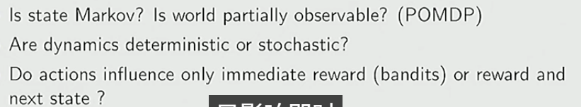

RLHF

optimization
delayed consequences
exploration
generalization

怎么确定是哪个操作决定了 最终的好结果

SL UL RL IL之间的差异 RL 的某些局限
SL：supervised learning
UL：unsupervised learning
RL：reinforcement learning
IL：Imitation learning

alpha tensor 

why is markov assumption popular   

types of sequential decision processes

