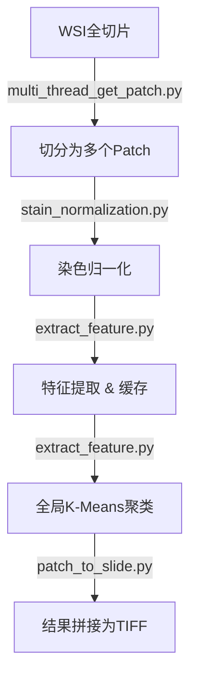

# XCellAligner 项目全面解析与教学文档

  

本文档旨在为您提供 XCellAligner 项目的深度解析，包括项目概述、Git 提交历史分析、以及核心推理流程（组织推理与整图细胞推理）的详细代码级讲解。

  

---

  

## 1. 项目概述

  

**XCellAligner** 是一个用于 H&E（苏木精-伊红染色）图像与 mIF（多重免疫荧光）图像之间进行细胞级语义对齐的框架。

- **核心痛点**: H&E 和 mIF 图像通常来自相邻切片，无法物理对齐（Pixel-level Registration）。

- **解决方案**: 通过跨模态对比学习，将 H&E 的细胞特征映射到 mIF 的特征空间。

- **价值**: 让 H&E 图像也能拥有类似 mIF 的丰富蛋白标记信息，用于下游的分类、分割或生存分析。

  

---

  

## 2. Git 提交修改分析

  

### 2.1 Commit: `f90314f93829f2df4f1ce002a2429b2abc70cbf5`

  

- **提交信息**: `Update README with XCellAligner details`

- **修改内容**:

  - `README.md`: 这是一个文档更新提交。

  - **作用**: 完善了项目的自我介绍、安装步骤、数据准备格式以及推理命令的示例文档。这是项目对外发布的重要补充。

  

### 2.2 Commit: `117bf2f37842544ef0e4bc03922a7d7d534c0f82`

  

- **提交信息**: `Add registration instructions & Optimized training process`

- **修改内容**: 这是一次包含核心功能重构的提交。

  

| 修改文件 | 核心变动 | 代码解释 |

| :--- | :--- | :--- |

| **`updated_models.py`** | **模型重构** | 1. **多潜在变量 (Multi-Latents)**: 引入 `num_cls_latents=32`，让模型学习多种全局上下文。<br>2. **反向交叉注意力**: 使用 `reverse_cross_attention`，Query为细胞特征，Key/Value为全局CLS，增强了细胞对全局信息的感知。<br>3. **细胞注意力偏置**: 新增 `cell_attn_bias`，根据细胞特征动态调整注意力权重。 |

| **`multidata_aligner_trainer.py`** | **训练流程优化** | 1. **多数据集联合训练**: 支持同时读取多个数据集路径 (`cache_dir` 列表)。<br>2. **混合损失函数**: 结合了 `hungary_mse_loss` (对齐误差) 和 `contrastive_loss` (对比学习损失)。<br>3. **困难负样本采样**: 在 `HeMifDataset` 中实现了 `_get_farthest_negative_samples`，提升对比学习效果。 |

| **`utils.py`** | **工具链增强** | 1. **集成 Cellpose**: 新增 `load_cellpose_model` 和 `extract_cell_features`，将分割与特征提取串联。<br>2. **特征融合**: `build_cell_features` 将深度特征与手工特征（面积、颜色）拼接。 |

  

---

  

## 3. 核心流程详解：代码流转与解析

  

### 3.1 组织推理 / 单图推理 (Tissue Patch Inference)

  

**应用场景**: 对单张裁剪好的组织块（Patch）进行细胞分析。

**核心文件**: `he_transformer_inference.py`

  

#### **流程图**


  

#### **核心代码解析**

  

**1. 特征提取 (`extract_cell_features_for_inference`)**

此函数负责从原始图像中提取出每个细胞的深度特征。

  

```python

def extract_cell_features_for_inference(image_path, cellpose_model, ctranspath_model, device):

    # 1. 预处理

    img = preprocess_image(image_path)

    # 2. Cellpose 分割 -> 得到 masks (每个细胞一个ID)

    masks, flows, styles = cellpose_model.eval(img, diameter=None, channels=[0, 0])

  

    # 3. 遍历每个细胞

    unique_masks = np.unique(masks)

    for label in unique_masks:

        if label == 0: continue # 跳过背景

        # 4. 抠图：利用 mask 将非细胞区域置零

        cell_mask = masks == label

        cell_img = img * cell_mask[..., None]

        # 5. CTransPath 提取特征 (1000维)

        cell_img_tensor = preprocess(Image.fromarray(cell_img)).unsqueeze(0).to(device)

        with torch.no_grad():

            features = ctranspath_model(cell_img_tensor)

        cell_features.append(features)

    return cell_features, masks, img

```

  

**2. 模型推理 (`inference`)**

此函数将提取的特征输入到对齐模型中。

  

```python

def inference(image_path, model_path, save_path, k=5):

    # ... 初始化模型 ...

    # 1. 提取特征

    cell_features, masks, original_image = extract_cell_features_for_inference(...)

    # 2. Padding: 将细胞数量补齐到 max_cells (例如 255)

    padded_features, mask = pad_features_to_max_cells(np.array(cell_features), max_cells)

    # 3. Transformer 推理

    # 输入: [1, max_cells, 1000]

    # 输出: model_output [1, max_cells, 8] (降维后的特征)

    with torch.no_grad():

        cls_output, model_output, logits = model(padded_features, mask_tensor)

    # 4. 取出有效特征 (去除 Padding 部分)

    valid_features = model_output[0, :len(cell_features)]

    # 5. 聚类与可视化

    kmeans = KMeans(n_clusters=k)

    # build_cell_features 会将深度特征与 (面积, RGB均值) 拼接

    enhanced_features = build_cell_features(original_image, masks, valid_features)

    cluster_labels = kmeans.fit_predict(enhanced_features)

    visualize_clusters(original_image, masks, cluster_labels, save_path, k)

```

  

---

  

### 3.2 整图细胞推理 (Whole Slide Inference)

  

**应用场景**: 对全切片（WSI）进行全景分析。由于显存限制，无法一次性读入，必须分块处理再拼接。

**入口文件**: `slide_inference.py`

**模块路径**: `slide_inference/`

  

#### **流程图**



  

#### **核心代码解析**

  

**Step 1: 切片分块 (`slide_inference/multi_thread_get_patch.py`)**

  

```python

def slide_to_patches(slide_path, patch_size=1024, save_dir="patches", num_workers=4):

    # 1. 读取 Slide 尺寸

    slide = openslide.OpenSlide(slide_path)

    w, h = slide.dimensions

    # 2. 生成任务列表 (每个 Patch 的坐标)

    tasks = []

    for i in range(rows):

        for j in range(cols):

            tasks.append((slide_path, i, j, x, y, ...))

    # 3. 多进程并行保存

    # 使用 ProcessPoolExecutor 提高 IO 效率

    with ProcessPoolExecutor(max_workers=num_workers) as executor:

        executor.map(process_patch, tasks)

```

  

**Step 2: 染色归一化 (`slide_inference/stain_normalization.py`)**

  

```python

def batch_color_normalize_with_white_mask(source, input_folder, output_folder):

    # 1. 加载参考图 (Source Image)

    # 根据器官类型 (Lung, Liver...) 选择不同的参考模板

    # 2. 初始化 ReinhardNormalizer

    normalizer = ReinhardNormalizer()

    normalizer.fit(source_image)

    # 3. 遍历每个 Patch 进行转换

    for img_path in png_files:

        original = load_image(img_path)

        # 4. 颜色迁移

        normalized = normalizer.transform(original)

        # 5. 背景保护 (关键!)

        # 计算原图的白背景掩码，将背景部分还原为纯白，防止被错误染色

        white_mask = np.all(original > white_threshold, axis=2)

        normalized[white_mask] = original[white_mask]

        save(normalized)

```

  

**Step 3: 特征提取与聚类 (`slide_inference/extract_feature.py`)**

  

此步骤最为复杂，分为**局部提取**和**全局聚类**两个阶段。

  

```python

def batch_inference(input_folder, ...):

    # --- 阶段一：局部提取 ---

    # 使用线程池处理每个 Patch

    with ThreadPoolExecutor() as executor:

        # 对每个 Patch 调用 process_single_image

        # process_single_image 内部逻辑同 3.1 中的 inference

        # 区别在于：只保存特征 (save_features_to_disk)，不立即聚类

        future = executor.submit(process_single_image, ...)

    # --- 阶段二：全局聚类 ---

    # 1. 加载所有 Patch 的特征文件 (.npy)

    all_features = np.concatenate([load(f) for f in feature_files])

    # 2. 全局 K-Means

    # 这样能保证整张 Slide 上颜色代表的类别是一致的

    kmeans = KMeans(n_clusters=k)

    global_labels = kmeans.fit_predict(all_features)

    # 3. 生成可视化 Patch

    # 重新遍历每个 Patch，根据全局标签绘制细胞颜色

    # 生成 *_cluster.png (黑底彩色图)

    visualize_clusters(..., global_labels[subset_idx], ...)

```

  

**Step 4: 结果拼接 (`slide_inference/patch_to_slide.py`)**

  

```python

def stitch_patches_to_multilevel_tiff_alternative(slide_path, patch_dir, out_path):

    # 使用 pyvips 库，它能处理比内存大得多的图像

    # 1. 创建空画布或行列表

    rows_imgs = []

    # 2. 按行拼接

    for r in range(rows):

        row_imgs = []

        for c in range(cols):

            # 读取对应的可视化 Patch

            img = pyvips.Image.new_from_file(patch_path)

            row_imgs.append(img)

        # 拼接一行

        rows_imgs.append(pyvips.Image.arrayjoin(row_imgs, across=len(row_imgs)))

    # 3. 纵向拼接所有行

    big_img = pyvips.Image.arrayjoin(rows_imgs, across=1)

    # 4. 保存为金字塔 TIFF

    big_img.tiffsave(out_path, pyramid=True, tile=True, compression="jpeg")

```

  

---

  

## 4. 文件结构与功能索引

  

| 路径 | 功能 | 备注 |

| :--- | :--- | :--- |

| `XCellFormer.py` | 定义模型基类 `XCellFormer` | 包含 ViT 和 Transformer 分支 |

| `updated_models.py` | 定义 `TransformerEncoder` | 推理时实际使用的模型结构 |

| `he_transformer_inference.py` | 单图推理脚本 | 包含完整的分割、特征提取、聚类流程 |

| `slide_inference.py` | 全切片推理总入口 | 串联分块、归一化、提取、拼接 |

| `slide_inference/` | 全切片推理子模块 | 包含具体的实现逻辑 |

| `multidata_aligner_trainer.py` | 训练脚本 | 支持多数据集联合训练 |

| `utils.py` | 通用工具 | Cellpose加载、图像预处理等 |

  

希望这份文档能帮助您深入理解 XCellAligner 的工作原理和代码结构。如有疑问，请查阅对应文件的源码。